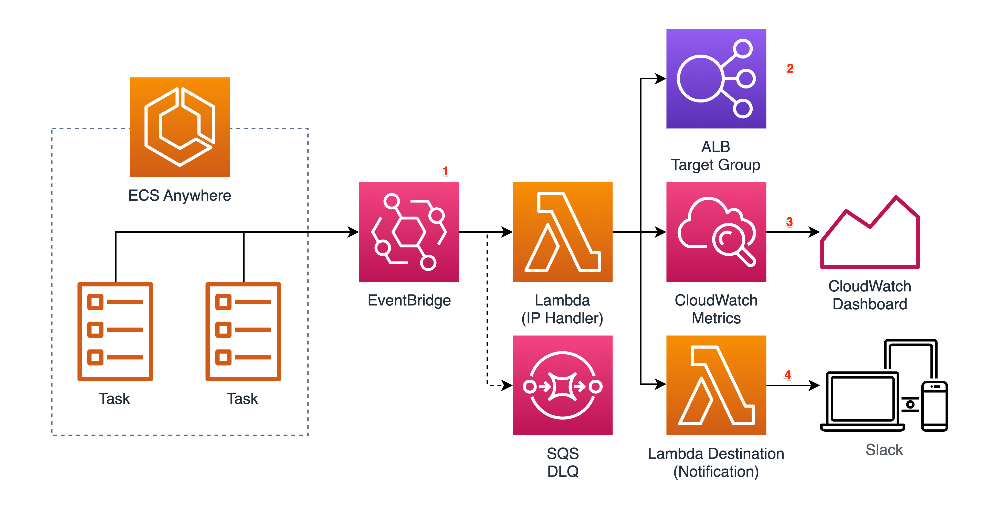

# Amazon ECS Anywhere Load Balancer Integration

This project demonstrates how to automate the process to detect when the Amazon ECS Anywhere tasks are provisioned/deprovisioned and then automatically register/deregister their external instance IPs and ports to/from the external load balancer e.g. AWS Application Load Balancer and 3rd party load balancers (that can be configured via the APIs).

## How it works?



1. The Amazon EventBridge rule was setup to filter the Amazon EventBridge events (emitted when Amazon ECS Anywhere tasks are created and deleted) by using the cluster name and service name and trigger the IP Handler AWS Lambda function.

2. The IP Handler AWS Lambda function uses the Amazon ECS API to get the task host port and the AWS Systems Manager (SSM) API to get the external instance IP and then use them to register/deregister as the target to/from the AWS Application Load Balancer.

3. The IP Handler AWS Lambda function also send the custom Amazon CloudWatch metrics for the success, failure and error counts by using Amazon CloudWatch embedded metric format (EMF). Amazon CloudWatch dashboard is built to show the total counts.

4. (Optional) The notification AWS Lambda function is triggered by AWS Lambda Destinations to send the results to the Slack channel.

## Setup

This demo uses 2 Amazon VPCs to simulate the on-prem and AWS region environments and then uses Amazon VPC Peering to simulate the connected network.

1. Fill in the `AWS_ACCOUNT_ID` and `AWS_REGION` values on the `.env` file. (Optionally, check the [Disclaimer](#disclaimer) section below and then create a [Slack webhook](https://api.slack.com/messaging/webhooks) and fill in the `SLACK_WEBHOOK_URL` value).

2. Deploy AWS infrastruture by using [AWS Cloud Development Kit (CDK)](https://docs.aws.amazon.com/cdk/v2/guide/getting_started.html).

```
cdk deploy --require-approval never
```

3. Create AWS SSM activation code.

```
aws ssm create-activation --iam-role ecs-a-lb-integration-ssm
```

4. Register the Amazon ECS Anywhere external instance. Use the command from the AWS CDK output on the step 2. to SSH into the instance with EC2 Instance Connect.

```
curl --proto "https" -o "/tmp/ecs-anywhere-install.sh" "https://amazon-ecs-agent.s3.amazonaws.com/ecs-anywhere-install-latest.sh"

CLUSTER_NAME=ecs-a-lb-integration
REGION=ap-southeast-1
ACTIVATION_ID=<ACTIVATION_ID>
ACTIVATION_CODE=<ACTIVATION_CODE>

sudo bash /tmp/ecs-anywhere-install.sh \
 --region $REGION \
 --cluster $CLUSTER_NAME \
 --activation-id $ACTIVATION_ID \
 --activation-code $ACTIVATION_CODE
```

3. Deploy Amazon ECS Anywhere service.

```
DEPLOY_SERVICE=1 cdk deploy --require-approval never
```

## Demo

1. Go to the Amazon ECS page on AWS console and verify that the service has 3 running tasks. Then, go the Amazon ECS page the Amazon EC2 page and verify that the IPs and ports were registered on the target group used by the load balancer and the service is accessible via the load balancer DNS name.

2. Stop 1 or more tasks and then verify that the old/new IPs and ports are removing/adding from/to the target group.

3. Check AWS Lambda function logs and Amazon CloudWatch metrics/dashboad. Optionally, check the notificaiton messages on the Slack channel.

4. Verify that the service is still accessible after the process completes.

## Cleanup

1. Go to the Amazon ECS page on AWS console and then deregister the [external instance](https://docs.aws.amazon.com/AmazonECS/latest/developerguide/ecs-anywhere-deregistration.html).

2. Go to the Amazon VPC page on AWS console and then delete the [EC2 Instance Connect Endpoint](https://docs.aws.amazon.com/AWSEC2/latest/UserGuide/create-ec2-instance-connect-endpoints.html).

3. Destroy AWS infrastruture by using AWS CDK.

```
DEPLOY_SERVICE=1 cdk destroy --require-approval never
```

## <a id="disclaimer"></a>Disclaimer

This solution optionally interacts with [Slack](https://slack.com/) which has terms published at https://slack.com/intl/en-gb/terms-of-service/user and pricing described at https://app.slack.com/plans. You should be familiar with the pricing and confirm that your use case complies with the terms before proceeding.

## Security

See [CONTRIBUTING](CONTRIBUTING.md#security-issue-notifications) for more information.

## License

This library is licensed under the MIT-0 License. See the LICENSE file.
